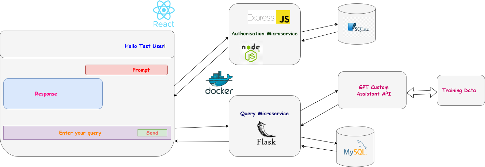
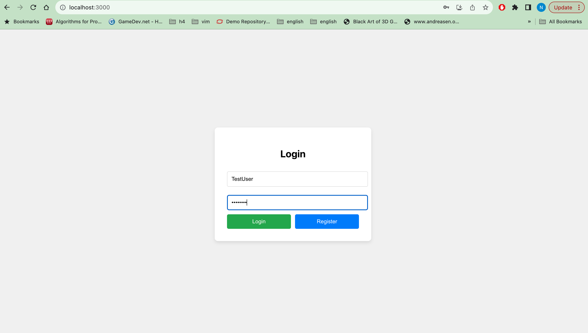
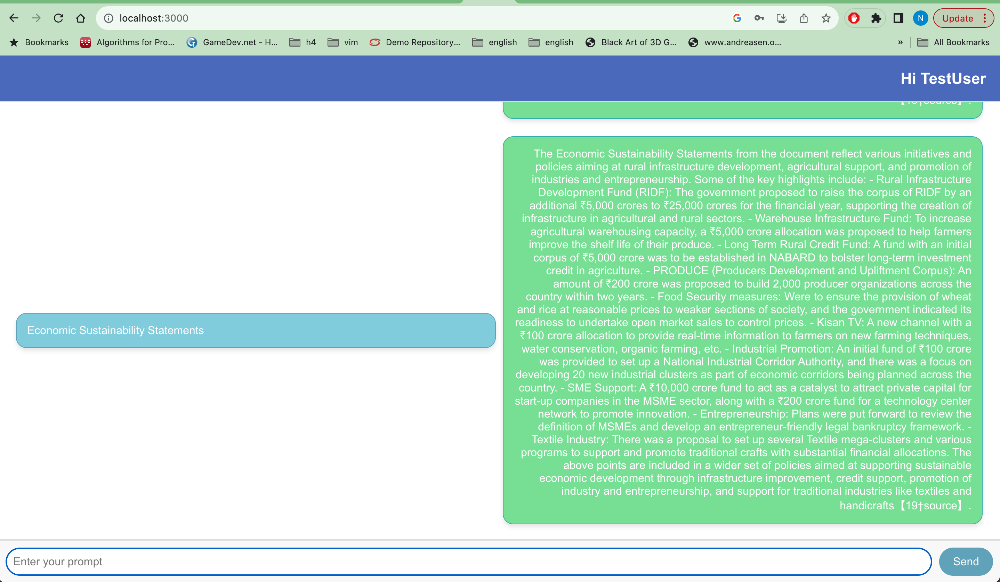

# Deal Techtives: CMPE 273-Enterprise Distributed Systems Hackathon Project

## Team Members
- Harshith Akkapelli
- Sanjay Bhargav Kudupudi
- Neeharika Singh

## Architecture Diagram

## Output Files and Screenshots

| Prompt                                          | Response (Text Format)                                                                     | Response (Screenshot Format)                                                               |
| ------------------------------------------------ | ------------------------------------------------------------------------------------------ | ------------------------------------------------------------------------------------------ |
| Economic Sustainability Statements               |  |  |
| Social Sustainability Statements                 |  |  |
| Social Security                                  |  |  |
| Rural Development                                |  |  |
| How Farmers benefit from the budget?             |  |  |
| Economic conditions of State and Central Government |  |  |
| How poor and marginalized communities benefit from budget? |  |  |
| Poverty reduction strategies                     |  |  |
| How women and poor children benefit from Budget? |  |  |
| Poverty Factors                                  |  |  |
| Country Balance of Payments                      |  |  |
| Weather & Extreme Weather Events                 |  |  |
| Recessions and Tariff                            |  |  |

## Instructions for Running Locally

### 1) MySQL Installation
- Install MySQL and start the server.
- Create Database named `MER_DB`: `create database MER_DB;`
- Set the below environment variables:
  - `OPENAI_KEY=`
  - `OPENAI_ASSISTANT=`
  - `MYSQL_URL=mysql://<username>:<password>@localhost/MER_DB`

### 2) Backend - query microservice
- Clone the repository: `git@github.com:ExpressNesters/273_Hackathon.git`
- Go to src folder: `cd backend_codebase/query_microservice/src`
- Run command: `pip install -r requirements.txt`
- Run command: `flask run`

### 3) Backend - authentication microservice
- Go to `backend_codebase/authentication_microservice`: `cd backend_codebase/authentication_microservice`
- Run command: `npm install`
- Run command: `npm start`

### 4) Frontend
- Go to `frontend_codebase/`: `cd frontend_codebase/`
- Run command: `npm install`
- Run command: `npm start`

### 5) Access the Application
- Access the application on: `http://localhost:3000/`

## Authentication Interface

## Chat Interface

